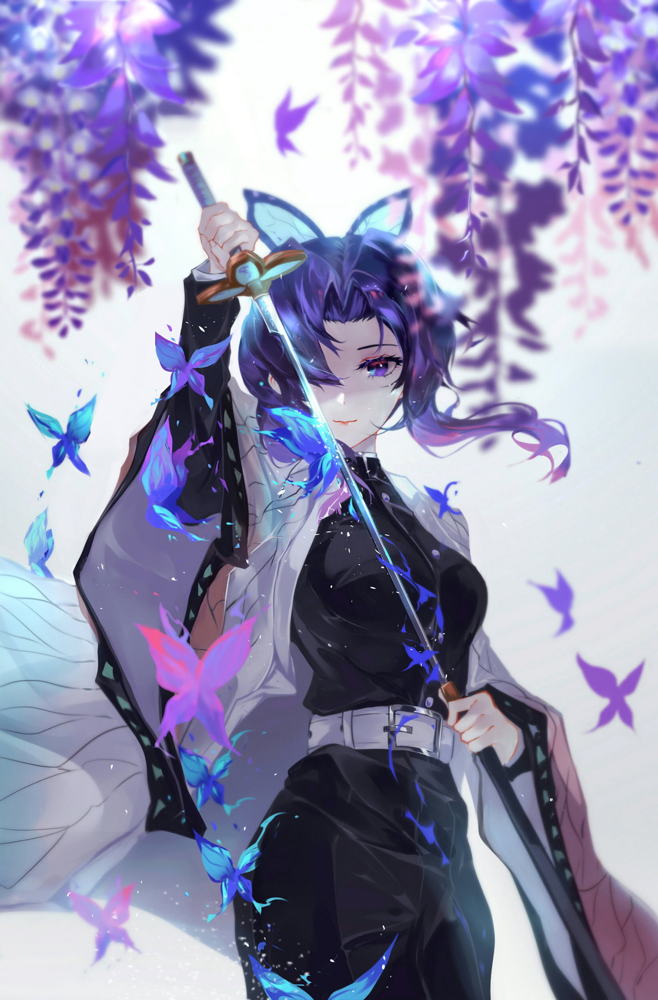

    
    

## 👋 About Me

Hi there! I'm Christian, a passionate developer who thrives on building full-stack applications. I have a focus on web development and application development, and I'm also interested in the world of machine learning. Welcome to my GitHub profile!

- 🌱 I’m currently learning advanced JavaScript, and machine learning.
- 💬 Ask me about web development, JavaScript, or any tech-related topics.
- 📫 How to reach me: [LinkedIn](https://www.linkedin.com/in/yohanes-christian-devano/) | [Twitter](https://x.com/Nestia27) | [Email](mailto:al.gendon39@gmail.com)

## 💻 Technologies & Tools

### 🖥️ Programming Languages

    
    
    
    
    

### 🖼️ Frontend Development

    
    
    
    

### 🏗️ Backend Development

    
    
    
    
    
    
    

### 🗄️ Databases

    
    
    
    
    

### 🛠️ Tools & DevOps

    
    
     
     

### 📌 Version Control

    
    

## 📊 GitHub Stats

  <!-- Activity Graph -->
  

<table align="center" style="max-width: 850px; width: 100%;">
  <tr>
    <td colspan="2" align="center">
      
    </td>
  </tr>
  
  <!-- Baris Bawah: Dibagi Jadi Dua Kolom Sejajar dan Rapat -->
  <tr>
    <!-- Sisi Kiri: Github Stats -->
    <td align="right" style="vertical-align: top; padding-top: 15px; padding-right: 10px; width: 50%;">
      
    </td>
    
<td align="left" style="vertical-align: top; padding-top: 15px; padding-left: 10px; width: 50%;">
      
    </td>
  </tr>
</table>

<picture>
  <source media="(prefers-color-scheme: dark)" srcset="https://raw.githubusercontent.com/NestiaDev-id/NestiaDev-id/main/assets/generated/pacman-contribution-graph-dark.svg">
  <source media="(prefers-color-scheme: light)" srcset="https://raw.githubusercontent.com/NestiaDev-id/NestiaDev-id/main/assets/generated/pacman-contribution-graph.svg">
  
</picture>

<picture>
  <source media="(prefers-color-scheme: dark)" srcset="https://raw.githubusercontent.com/NestiaDev-id/NestiaDev-id/main/assets/generated/github-snake-dark.svg">
  <source media="(prefers-color-scheme: light)" srcset="https://raw.githubusercontent.com/NestiaDev-id/NestiaDev-id/main/assets/generated/github-snake.svg">
  
</picture>
